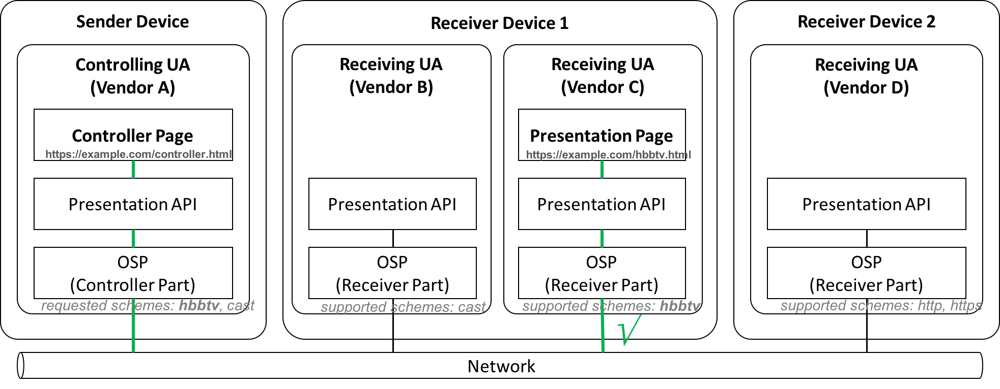

# Schemes and Open Screen Protocol

This document discusses the usage of HTTP schemes as a mechanism to make [Open
Screen Protocol](https://webscreens.github.io/openscreenprotocol/) (OSP) agents
extensible to support other kinds of applications in the future without the need
for agreement between the agent implementations.

The Presentation API allows a controller page to launch a presentation page on a
display using the 
[`PresentationRequest`](https://www.w3.org/TR/presentation-api/#interface-presentationrequest)
interface. The `PresentationRequest` constructor accepts a URL or a sequence of
URLs of the presentation page as input. While the current Presentation API spec
defines the behavior of `https` URLs, it does not forbid the usage of other URLs
with other schemes.

For example the `cast` scheme is used in the Presentation API tests as an
alternative scheme to support [Google Cast](https://developers.google.com/cast/)
receivers like Chromecast and Android TV. Let us consider the following example
as input for discussion:

```javascript
var urls = [
     "hbbtv:?appId=123&orgId=456&appName=myHbbTVApp&appUrl=" +
         encodeURIComponent("https://example.com/hbbtv.html"),
     "https://example.com/presentation.html",
     "cast:1234567"
];
var request = new PresentationRequest(urls);
```

This example provides three URLs with different schemes: `hbbtv`, `https` and
`cast`. The controlling UA that implements the OSP can use these schemes to
filter presentation screens during discovery (regardless of which discovery
protocol is used or how filtering is implemented).

In order for a user to launch a presentation with a non-https URL scheme, they
must have a presentation screen available that responds postively to screen
availability requests for URLs with that scheme.

If a single presentation screen supports more than one URL in a single
`PresentationRequest,` the order of URLs is used by the controlling UA to decide
which URL will be launched on that screen.  This possibility is shown in the
diagram below.  If `Receiver Device 1` advertises itself as a single
presentation screen, and the user chooses it as the target for `request`, then
the controlling UA will launch the `hbbtv:` URL on it.



If the controlling page needs the user to choose which URL to present, it can
create a separate `PresentationRequest` object for each URL.  This is not
recommended, as this would require the user to choose a connection technology
(by virtue of calling `PresentationRequest.start()` on a URL-specific
`PresentationRequest`).  The user should generally not care about the details of
the connection technology being used by the presentation screen.

Alternatively, the presentation screen can advertise itself as multiple Open
Screen Protocol endpoints, each of which advertises availability for a different
scheme.  In the case above, the user would see two distinct presentation screens
in its screen list, "Receiver Device 1 (HBBTv)" and "Receiver Device 1 (Cast)".
Again, this is not recommended as the user should not care about the connection
technology used by a given screen.

## Extensibility

The mechanism of using schemes in the OSP allows controlling pages to support
additional receiver application types.  For example, Android TV could implement
the OSP receiver for native TV applications in the future and advertise them
using the scheme `android.` A native Android TV app with a native library that
acts as a presentation receiver could then be lauched and controlled by a
controlling web page through the Presentation Controller API.

Or, a controlling web page could open an HbbTV Web application on the OSP
receiver with an `hbbtv:` URL.  The page would use the `hbbtv` URL scheme to
pass additional parameters that enable the receiving web page to access
broadcast-specific functionality.

## Interoperability

There remain interoperability concerns with supporting non-https schemes through
the OSP.  A browser may need to support additional features that are not part of
the core OSP standard to work with a non-https application; this is true of
`cast:` URLs today, for example.  Browsers that do not have these features may
believe that a non-https URL is available for presentation (because the
receiving agent reports the URL as supported), but not be able to launch and
control the presentation successfully via OSP.  If [OSP
extensions](https://webscreens.github.io/openscreenprotocol/#protocol-extensions)
are required to control a non-https presentation, the non-https scheme may
need to be mapped to an [OSP capability](https://github.com/webscreens/openscreenprotocol/blob/gh-pages/capabilities.md) so that agents can accurately determine compatbility.

Another concern is the Web security model. Today, browsers decide which schemes
should be considered secure from the controlling origin's point of view, and
block URLs that do not meet those requirements.  As OSP is intended to create a
secure endpoint to the receiving agent, the expectation is that browsers should
make an OSP-compliant endpoint accessible from secure contexts, even for
presentations launched with non-https URLs.

## Scheme based filtering

As discussed before, schemes can be used as a mechanism to filter devices during
discovery. Two possible options:

1. The controlling UA sends the list requested schemes in the discovery request
   and receivers that support at least one scheme from the requested list should
   reply. Furthermore, discovery response of the receiver should include a
   sublist of supported schemes.
2. The controller UA don't send any scheme in the discovery request. The
   presentation screen should reply to any discovery request with a list of all
   supported schemes. The controlling UA matches the list of requested schemes
   with the list of supported schemes from each receiver to decide which device
   to consider.

## HbbTV scheme

The example above shows the usage of `hbbtv` scheme. Basically, all required
parameters to address an [HbbTV application](https://www.hbbtv.org/) on the terminal
can be serialized as URL query parameters. The HbbTV URL in the example above
contains the parameters `appId` (application ID) , `orgId` (organization ID),
`appName` (application name) and `appUrl` (application URL), but other
parameters can be supported in the same way. A receiver that advertises itself
(e.g. `Receiver Device 1` depicted in the figure above) as a HbbTV terminal
should use the scheme `hbbtv` during discovery.

*TODO:*
[Issue #94: Semantics of hbbtv: URLs](https://github.com/webscreens/openscreenprotocol/issues/94)

