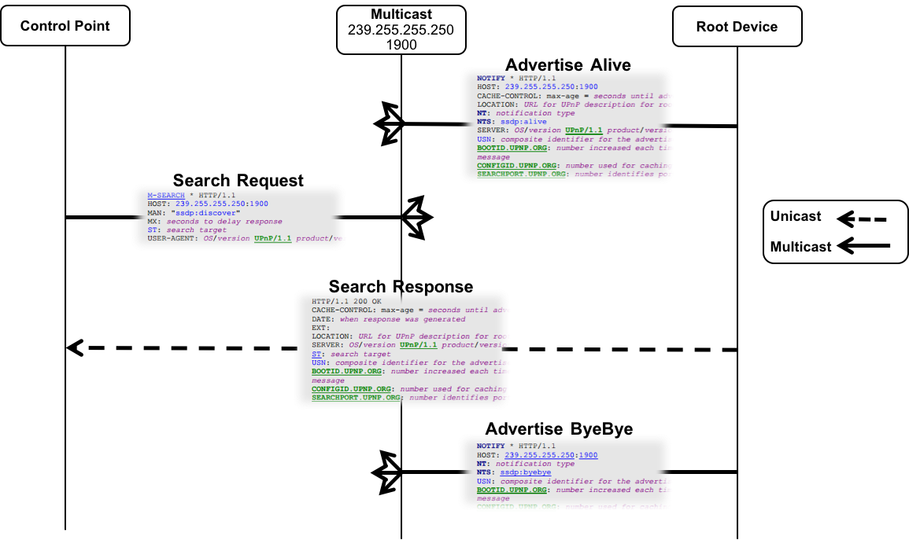

# SSDP

SSDP (Simple Service Discovery Protocol) is the first layer in the [UPnP (Universal Plug and Play) Device Architecture](http://www.upnp.org/specs/arch/UPnP-arch-DeviceArchitecture-v1.1.pdf). It allows control points (term used in UPnP architecture for control devices like smartphones or tablets) to search for devices or services of interest on the network. The SSDP protocol is also used in other standards/specifications without using the whole UPnP stack. One example is the [DIAL (Discovery and Launch)](http://www.dial-multiscreen.org/) which is a protocol that allows second-screen devices like smartphones or tablets to discover and launch applications on first-screen devices like TVs. Another example is [HbbTV 2.0 (Hybrid broadcast broadband TV)](https://www.hbbtv.org/wp-content/uploads/2015/07/HbbTV-SPEC20-00023-001-HbbTV_2.0.1_specification_for_publication_clean.pdf) which uses DIAL as underlying protocol to discover HbbTV devices and launch HbbTV applications. In [Physical Web Project](https://github.com/google/physical-web) there is a [proposal](https://github.com/google/physical-web/blob/master/documentation/ssdp_support.md) from [Fraunhofer FOKUS](https://www.fokus.fraunhofer.de/fame) on how to use the SSDP protocol to advertise and find URLs in local network.

# Design and Specification

SSDP allows root devices (term used in UPnP architecture for devices that offer services like TVs, printers, etc.) to advertise their services to control points on the network. It also allows control points to search for devices or services of interest at any time. SSDP specifies the discovery messages that are exchanged between control points and root devices. SSDP messages contain specific information about the service/device like type, unique device identifier, etc. SSDP uses part of the header field format of HTTP 1.1 ,but it is not based on full HTTP 1.1 as it uses UDP instead of TCP and it has its own processing rules. The following sequence diagram shows the SSDP message exchange between a control point and root device.

 

Message Flow:
1. the root device adverties its services on the network by sending for each service it offers a "NOTIFY" message from type "ssdp:alive" to the multicast address "239.255.255.250:1900" with all the necessary information needed to access the service. Control points listening on the multicast address receive the message and check if the service is relevent for them or not. The NT header can be used to check the type of the service. To access more information about the service/device the control point needs to access the device description (format is specified in UPnP) by making an HTTP request to the URL provided in the LOCATION header of the SSDP message. The device description is a XML document that contains information about the device/service like friendly name, capabilities, etc.
1. a control point can search for root devices at any time by sending a SEARCH message to the multicast address. The search request contains the ST (search target) header specify the type of the service the control point is looking for. All devices listing to the multicast address will receice the search message.
1. when a root device receives a search message and if it offers the requested service (by checking the ST header), it replies with a SEARCH response message only to the control point that sends the request (unicast).
1. when a service is no more available, the root device needs to advertise a "NOTIFY" message from type "ssdp:byebye" with information about the correponding service. Control points can remove the service if it is listed. 

# Evaluation

this section evaluates SSDP as discovery protocol for the OpenScreenProtocol according several functional and non-functional requirements

## Functional Requirements

We will consider in the functional requirements the Prensentation API (and later also RemotePlayback API). The relevant part of the Presentation API is  section [6.4 Interface PresentationAvailability](https://w3c.github.io/presentation-api/#interface-presentationavailability) and will be discussed in next subsecion. 

### Presentation API: Monitor Display Availability

##ä Remote Playback API: Monitor Display Availability

## Non-functional Requirements

### Reliability

### Latency of device discovery / device removal

### Ease of implementation / deployment

### Security - both of the implementation, and whether it can be leveraged to enhance security of the entire protocol

### Privacy: what device information is exposed

### Network efficiency

### Power efficiency

### IPv4 and IPv6 support

### Standardization status and likelihood of successful interop
